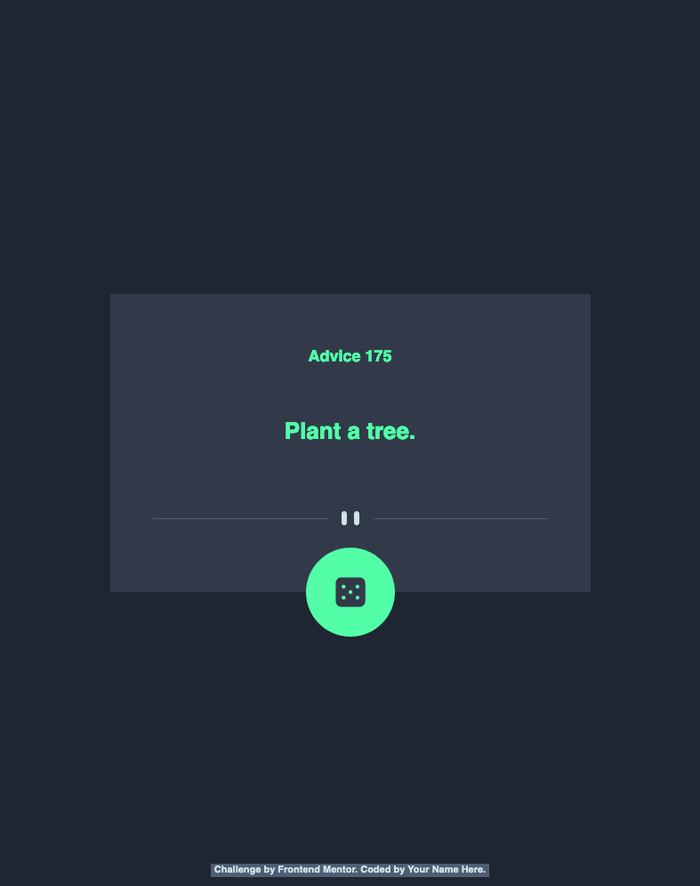

# Frontend Mentor - Advice generator app solution

This is a solution to the [Advice generator app challenge on Frontend Mentor](https://www.frontendmentor.io/challenges/advice-generator-app-QdUG-13db). Frontend Mentor challenges help you improve your coding skills by building realistic projects.

### The challenge

Click the dice to see some advice; taken from the Advice API at https://api.adviceslip.com

- 

### Screenshot

### Links

- Solution URL: [https://github.com/Richard2957/advice-generator-app-main](https://github.com/Richard2957/advice-generator-app-main)
- Live Site URL: [https://richard2957.github.io/advice-generator-app-main/](https://richard2957.github.io/advice-generator-app-main/)

### Built with

Vanilla JS and CSS

### What I learned

Syncing animations and fetch()